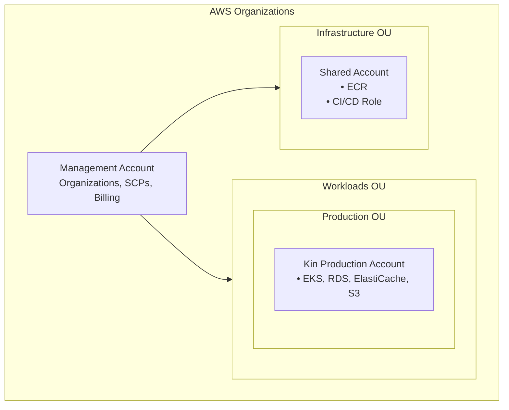

# Kin Infrastructure

This directory contains the IaC for deploying Kin Core Service on AWS using Terragrunt, EKS, and ArgoCD.

## Multi-Account Architecture



## Directory Structure

```
infrastructure/
├── README.md
├── root.hcl                    # Root Terragrunt config
├── bootstrap/
│   └── org/                    # AWS Organizations (run from management account)
├── _envcommon/                 # Shared module configs
│   ├── eks.hcl                 # EKS cluster + core addons
│   ├── eks-node-groups.hcl     # EKS managed node groups
│   ├── pod-identity.hcl        # Pod identity for kin-core-svc
│   ├── rds.hcl                 # PostgreSQL database
│   ├── vpc.hcl                 # VPC networking
│   └── ...
├── modules/
│   ├── eks-addons/             # Helm charts (External Secrets, ALB Controller, OTEL)
│   ├── pod-identity/           # Pod identity configuration
│   └── iam-roles/              # IAM roles module (assumable roles)
└── live/
    ├── shared/                 # Shared account (ECR, GitHub OIDC) - plain OpenTofu
    └── production/             # Production environment - Terragrunt
        ├── iam-roles/          # IAM roles (deployment, CI, etc.)
        ├── vpc/
        ├── vpc-endpoints/
        ├── eks/                # EKS cluster + core addons (vpc-cni, kube-proxy, coredns)
        ├── eks-node-groups/    # Managed node groups (depends on eks)
        ├── eks-addons/         # Helm charts (depends on eks-node-groups)
        ├── pod-identity/
        ├── rds/
        ├── elasticache/
        ├── s3/
        └── ...
```

## Prerequisites

1. **AWS Management Account** with Organizations enabled
2. **Tools** (installed via Nix flake):
   - OpenTofu
   - Terragrunt
   - AWS CLI v2
   - kubectl, Helm, ArgoCD CLI

Enter the Nix development shell:

```bash
nix develop
```

## Initial Setup

### Step 0: Manual Prerequisites (ClickOps)

Before running any OpenTofu commands, you must manually create the following resources in the **management account** via the AWS Console:

#### 1. Create S3 Bucket for State

1. Go to **S3** in AWS Console
2. Click **Create bucket**
3. Configure:
   - **Bucket name**: `kin-mgmt-tfstate`
   - **Region**: `ap-southeast-2`
   - **Object Ownership**: ACLs disabled (recommended)
   - **Block Public Access**: Block all (enabled)
   - **Bucket Versioning**: Enable
   - **Default encryption**: SSE-S3 or SSE-KMS
4. Click **Create bucket**

#### 2. Create DynamoDB Table for State Locking

1. Go to **DynamoDB** in AWS Console
2. Click **Create table**
3. Configure:
   - **Table name**: `kin-mgmt-tf-locks`
   - **Partition key**: `LockID` (String)
   - **Table settings**: Default settings (On-demand capacity)
4. Click **Create table**

#### Why ClickOps for State Backend?

The state bucket and lock table must exist before OpenTofu can initialize. This is a chicken-and-egg problem - you can't use OpenTofu to create the resources that OpenTofu needs to store its state. These resources are created once per account and rarely change.

---

### Step 1: Bootstrap AWS Organizations (Management Account)

Run from your **management account**:

```bash
cd infrastructure/bootstrap/org

# Copy and edit the variables
cp terraform.tfvars.example terraform.tfvars

tofu init

# If AWS Organization already exists, import it first:
ORG_ID=$(aws organizations describe-organization --query 'Organization.Id' --output text)
tofu import aws_organizations_organization.org $ORG_ID

# Review changes and apply
tofu plan
tofu apply
```

> **Note:** The import step is required if your AWS account already has an Organization.
> If you get `AlreadyInOrganizationException`, run the import command above.

This creates:

- AWS Organizations with OUs
- Shared Resources account (`kin-shared`)
- Production account (`kin-production`)
- Service Control Policies
- State buckets and lock tables for each member account (`kin-shared-tfstate`, `kin-production-tfstate`)

Note the account IDs from the output:

```bash
tofu output
```

#### Secure New Member Accounts

After creating the accounts, you'll receive emails for each new account:

1. Go to [AWS Console](https://console.aws.amazon.com/) → Root user → enter account email → Next → Forgot password
2. Set a strong root password for each account
3. (Optional) Set up MFA/Passkey for each account root user
4. Store credentials securely

> **Note:** You'll use `OrganizationAccountAccessRole` for day-to-day access, not root. The `DenyRootUserActions` SCP blocks most root actions. MFA on member account roots is optional but recommended for compliance.
>
> **To set up MFA:** The `DenyRootUserActions` SCP must be temporarily disabled. Comment out `workloads_deny_root` attachment in `bootstrap/org/main.tf`, run `tofu apply`, set up MFA, then re-enable and apply again.

### Step 2: Deploy Shared Account Resources

> **Note:** The shared state bucket (`kin-shared-tfstate`) was already created by the org bootstrap.

Assume role into the **shared account**:

```bash
# Option 1: Use AWS CLI profiles
aws configure --profile kin-shared
# Set role_arn to the OrganizationAccountAccessRole

# Option 2: Assume role directly
eval $(aws sts assume-role \
  --role-arn arn:aws:iam::216302319215:role/OrganizationAccountAccessRole \
  --role-session-name shared \
  --query 'Credentials.[AccessKeyId,SecretAccessKey,SessionToken]' \
  --output text | awk '{print "export AWS_ACCESS_KEY_ID="$1" AWS_SECRET_ACCESS_KEY="$2" AWS_SESSION_TOKEN="$3}')
```

Deploy shared account resources:

```bash
cd infrastructure/live/shared

# Copy and configure variables
cp terraform.tfvars.example terraform.tfvars
# Edit terraform.tfvars with your environment account IDs

tofu init
tofu apply
```

This creates:

- ECR repositories (shared across environments)
- GitHub Actions OIDC role for ECR push
- Cross-account pull policies for all configured environments

Note the `github_actions_role_arn` and `ecr_repository_urls` from the output.

### Step 3: Deploy Production Infrastructure

Assume role into the **production account**:

```bash
# Option 1: Use AWS CLI profile (recommended)
export AWS_PROFILE=kin-production

# Option 2: Assume role directly
eval $(aws sts assume-role \
  --role-arn arn:aws:iam::646044945002:role/OrganizationAccountAccessRole \
  --role-session-name production \
  --query 'Credentials.[AccessKeyId,SecretAccessKey,SessionToken]' \
  --output text | awk '{print "export AWS_ACCESS_KEY_ID="$1" AWS_SECRET_ACCESS_KEY="$2" AWS_SESSION_TOKEN="$3}')
```

Deploy production infrastructure:

```bash
cd infrastructure/live/production

# Deploy all infrastructure
terragrunt run-all apply
```

### Step 4: Add GitHub Secrets

Add to your GitHub repository:

| Secret                | Value                                  | Source               |
| --------------------- | -------------------------------------- | -------------------- |
| `AWS_SHARED_ROLE_ARN` | Shared account GitHub Actions role ARN | `live/shared` output |

## Account Access

### AWS CLI Profiles

Configure your `~/.aws/config`:

```ini
[profile kin-management]
region = ap-southeast-2

[profile kin-shared]
role_arn = arn:aws:iam::216302319215:role/OrganizationAccountAccessRole
source_profile = kin-management
region = ap-southeast-2

[profile kin-production]
role_arn = arn:aws:iam::646044945002:role/OrganizationAccountAccessRole
source_profile = kin-management
region = ap-southeast-2
```

Then use:

```bash
aws --profile kin-production eks update-kubeconfig --name kin-production
```

## Deployment Order

```
1. Organizations (management account)      → Creates accounts, SCPs, and state buckets
2. Shared account (live/shared)            → ECR, GitHub OIDC
3. Production VPC                          → Network infrastructure
4. Production VPC Endpoints                → Private AWS service connectivity
5. Production IAM Roles                    → Deployment role, CI roles
6. Production RDS, ElastiCache, S3         → Data layer (parallel)
7. Production Secrets                      → Secrets Manager
8. Production EKS                          → Kubernetes cluster + core addons
9. Production EKS Node Groups              → Managed node groups (after addons ready)
10. Production Pod Identity                → IAM roles + Pod Identity associations
11. Production EKS-addons                  → ESO, ALB Controller, OTEL (Helm charts)
12. Production ArgoCD                      → GitOps (auto-deploys app)
```

### EKS Module Dependencies

The EKS stack is split into three modules to ensure proper ordering:

```
eks (cluster + addons) → eks-node-groups → eks-addons (Helm)
```

| Module | Contents | Purpose |
|--------|----------|---------|
| `eks` | Cluster + core addons (vpc-cni, kube-proxy, coredns, eks-pod-identity-agent) | Addons must be active before nodes join |
| `eks-node-groups` | Managed node groups | Waits for addons via Terragrunt dependency |
| `eks-addons` | Helm charts (External Secrets, ALB Controller, OTEL) | Requires healthy nodes to schedule pods |

This separation prevents the race condition where nodes try to join before the vpc-cni addon is ready, which causes "NetworkPluginNotReady" errors.

### EKS Node Access

Nodes have SSM Agent installed for secure shell access (no SSH keys required):

```bash
# List managed instances
aws ssm describe-instance-information --region ap-southeast-2

# Connect to a node
aws ssm start-session --target <instance-id> --region ap-southeast-2
```

### Debugging EKS Node Issues

```bash
# Check node group status
aws eks describe-nodegroup \
  --cluster-name kin-production \
  --nodegroup-name default \
  --region ap-southeast-2

# Check addon status
aws eks list-addons --cluster-name kin-production --region ap-southeast-2
aws eks describe-addon --cluster-name kin-production --addon-name vpc-cni --region ap-southeast-2

# Get EC2 console output (boot logs)
aws ec2 get-console-output --instance-id <instance-id> --region ap-southeast-2

# On node via SSM: check kubelet
sudo journalctl -u kubelet -n 100 --no-pager

# On node via SSM: check CNI logs
sudo cat /var/log/aws-routed-eni/ipamd.log | tail -100
```

## Security

- **Account Isolation**: Workloads separated from shared resources
- **SCPs**: Enforce region restrictions, deny root user, require IMDSv2
- **Cross-Account ECR**: Production pulls images from Shared account
- **Pod Identity**: Pods use EKS Pod Identity for AWS access (replaces IRSA)
- **RDS IAM Auth**: Database authentication via IAM tokens (no passwords)
- **Secrets**: AWS Secrets Manager for admin credentials

### IAM Roles

Environment-specific IAM roles are defined in `live/{env}/iam-roles/`. These roles can be assumed by SSO users for specific tasks.

**Production Roles:**

| Role | Purpose | Assumed By |
|------|---------|------------|
| `kin-production-deployment` | Infrastructure provisioning and EKS deployments | AdministratorAccess SSO users |

The deployment role has:
- **PowerUserAccess** - Full access to AWS services
- **Scoped IAM** - Manage roles, policies, instance profiles, OIDC providers (excludes users/groups)

**Assuming the deployment role:**

```bash
# After logging in via SSO with AdministratorAccess
aws sts assume-role \
  --role-arn arn:aws:iam::646044945002:role/kin-production-deployment \
  --role-session-name deployment
```

### RDS IAM Authentication

The application uses IAM database authentication instead of passwords. This provides:

- No password rotation needed - tokens are generated on-demand (valid 15 min)
- Existing connections stay open even after token expiry
- Audit trail via CloudTrail

**One-time database setup** (after RDS is created):

```sql
-- Connect as postgres using Secrets Manager password
CREATE USER core_svc;
GRANT rds_iam TO core_svc;
GRANT ALL PRIVILEGES ON DATABASE kin TO core_svc;
```

**Application connection**:

```go
import "github.com/aws/aws-sdk-go-v2/feature/rds/auth"

// Generate token for each new connection
token, err := auth.BuildAuthToken(ctx, dbEndpoint, region, "core_svc", cfg.Credentials)
// Use token as password
```
